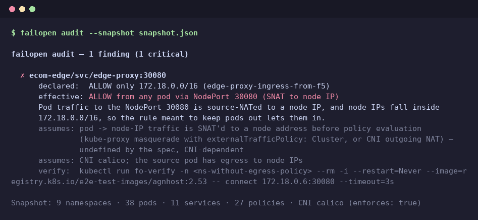

# failopen

**Your NetworkPolicy says DENY. failopen shows what gets through anyway.**

NetworkPolicy describes segmentation at the Kubernetes API level. Underneath
is a real network — kube-proxy NAT, CNI quirks, host networking — and the
Kubernetes docs leave several of those interactions *undefined*. failopen
reads your cluster (read-only, like `kubectl get`) and reports where the
policy you wrote does not mean what it looks like it means.



<sub>Audit of the `ecommerce-northwind-overlap` lab cluster (Calico) from its
saved snapshot — the same output as a live `failopen audit` against it.</sub>

<details><summary>Text version</summary>

```
failopen audit — 1 finding (1 critical)

  ✗ ecom-edge/svc/edge-proxy:30080
      declared:  ALLOW only 172.18.0.0/16 (edge-proxy-ingress-from-f5)
      effective: ALLOW from any pod via NodePort 30080 (SNAT to node IP)
      Pod traffic to the NodePort 30080 is source-NATed to a node IP, and node IPs fall inside
      172.18.0.0/16, so the rule meant to keep pods out lets them in.
      assumes: pod -> node-IP traffic is SNAT'd to a node address before policy evaluation
               (kube-proxy masquerade with externalTrafficPolicy: Cluster, or CNI outgoing NAT) —
               undefined by the spec, CNI-dependent
      assumes: CNI calico; the source pod has egress to node IPs
      verify:  kubectl run fo-verify -n <ns-without-egress-policy> --rm -i --restart=Never ...

Snapshot: 9 namespaces · 38 pods · 11 services · 27 policies · CNI calico (enforces: true)
```

</details>

> **Status:** pre-release, working towards v0.1. Output and flags may change.

## What it detects

| Detector | Severity | What it means |
|---|---|---|
| `cni` | critical / warning | NetworkPolicies exist, but the CNI doesn't implement them (flannel, k3s with `--disable-network-policy`, kindnet before kind v0.24). Every policy is decoration. Recognised: Calico, Cilium, Canal, Antrea, kube-router, kindnet, flannel, k3s. Anything else is a warning: "enforcement unverified". |
| `ipblock-node-ips` | critical / warning | A pod exposed through a NodePort/LoadBalancer or hostPort has an ingress `ipBlock` that admits node IPs but not pods ("internet, but not pods", or an external range overlapping the nodes). Pod traffic to that port gets SNAT'd to a node IP and passes the rule meant to keep pods out. Critical for a closed allowlist overlapping the nodes, warning for an internet-wide "anything but pods". Not reported on Cilium, which doesn't match ipBlocks against cluster traffic (measured). |
| `hostnetwork-under-policy` | critical / warning | A NetworkPolicy selects a `hostNetwork: true` pod. The pod lives in the node's network namespace, where the CNI doesn't enforce pod policy (the spec calls it undefined; measured on Calico and Cilium). Its ports on the node IP are open to every node, hostNetwork pod, external client and any pod whose own egress allows it. Warning if the CNI is unknown. |

Every finding says what it **assumes** (CNI, NAT behaviour) and gives a
**verify** command that demonstrates it on your cluster. If failopen can't
confirm an assumption — unknown CNI, unknown pod CIDR — the finding is
downgraded, never inflated.

## Usage

```bash
go install github.com/kkattl/failopen/cmd/failopen@latest

failopen audit                           # current kubeconfig context
failopen audit --kubeconfig ~/.kube/prod
failopen snapshot > cluster.json         # save a snapshot...
failopen audit --snapshot cluster.json   # ...and audit it offline
```

**Exit codes** (CI-friendly):

| Code | Meaning |
|---|---|
| 0 | no critical findings |
| 1 | critical findings |
| 2 | the audit could not run (bad flags, cluster unreachable, …) |

**Access:** read-only `list` on pods, services, networkpolicies, namespaces,
nodes, daemonsets; optionally Calico `ippools` and the flannel/Cilium
ConfigMaps to learn the pod CIDR. No agents, no CRDs, nothing written to the
cluster.

## How we know the findings are real

Detectors are static, but they are checked against **measured** behaviour.
`hack/oracle` deploys realistic scenarios on production-shaped
[kind](https://kind.sigs.k8s.io/) clusters (node pools, taints, zones) with
different CNIs, probes every source → target pair from real pod identities,
records the source address each target actually saw, and compares it with
what NetworkPolicy declares (via
[policy-assistant](https://github.com/kubernetes-sigs/network-policy-api)).
The results live in `testdata/scenarios/` — see its README for the method
and its threats to validity.

```bash
make matrix PROFILES="calico cilium flannel"   # measure the corpus (hours)
make corpus-summary                            # verdicts per profile x scenario
```

The evaluation is in [docs/experiments](docs/experiments/README.md). It
covers accuracy against measurement (precision 17/17, recall 17/18), CNI
detection on 10 distributions, a comparison with Kubescape and
netpol-analyzer, sensitivity to kube-proxy mode and missing data,
performance (50k pods in 1.2 s) and an API audit log showing read-only
access.

## Limitations

- Findings rest on assumptions about NAT and CNI behaviour that the
  Kubernetes spec leaves undefined; they are stated per finding.
- Measured on kind with iptables kube-proxy: Calico (IPIP), Cilium
  (VXLAN, kube-proxy kept), flannel. Cloud CNIs (AWS VPC CNI, GKE Dataplane
  V2) and kube-proxy replacements are not measured yet.
- IPv4/TCP only. CNI-specific policy CRDs (Calico GlobalNetworkPolicy,
  Cilium CCNP, AdminNetworkPolicy) are not read yet.
- Known misses, measured:
  - non-system hostNetwork agents that share nodes with a protected
    namespace (the node-local exception);
  - on Cilium, a NodePort with `externalTrafficPolicy: Cluster` behind an
    ipBlock that excludes pods.

  Both are planned detectors.
- The CNI is identified by DaemonSet names, image tags and node
  annotations. A renamed DaemonSet, or an engine configured not to
  enforce, fools it. Each finding's `verify:` command checks it on the
  live cluster.

## License

Apache 2.0
