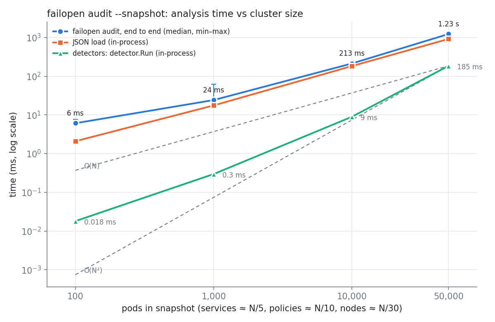

# Experiment 5: performance (analysis time vs cluster size)

**Question.** Is `failopen audit` fast enough for real clusters and for CI?

**Answer.** Yes. An offline audit of a 10,000-pod snapshot takes 0.21 s end to end. A 50,000-pod snapshot takes 1.2 s and peaks at 1.2 GB RSS. JSON decoding accounts for 75–85 % of the time at every size of 1,000 pods and up, and it scales linearly. The detectors are quadratic in cluster size, as the code predicts, but their constant is small: 185 ms at 50,000 pods.



## Results

Each size has 5 runs. "Wall" is the end-to-end time of `bin/failopen audit --snapshot X --color=never`: process start, JSON load, detectors, rendering to a file. Load, detect and render come from an in-process split of the same work (`hack/experiments/exp5/bench`, median of 5).

| pods | services | policies | namespaces | nodes | snapshot | wall median (min–max) | peak RSS | JSON load | detectors | render | findings (crit / warn) |
|---:|---:|---:|---:|---:|---:|---|---:|---:|---:|---:|---|
| 100 | 20 | 10 | 4 | 3 | 0.6 MB | 6.1 ms (5.9–7.7) | 25 MB | 2.1 ms | 0.018 ms | 0.006 ms | 1 (0 / 1) |
| 1,000 | 194 | 100 | 22 | 33 | 5.7 MB | 24.2 ms (23.5–61.9*) | 43 MB | 17.6 ms | 0.30 ms | 0.05 ms | 14 (10 / 4) |
| 10,000 | 1,934 | 1,000 | 202 | 333 | 57.5 MB | 213 ms (212–215) | 221 MB | 183 ms | 9.0 ms | 0.65 ms | 176 (83 / 93) |
| 50,000 | 9,667 | 5,000 | 1,002 | 1,666 | 287.6 MB | 1.23 s (1.21–1.24) | 1,245 MB | 920 ms | 185 ms | 2.9 ms | 770 (395 / 375) |

\* A single slow run (likely noise from the clusters running on the same machine). The median is unaffected.

Raw numbers are in [`results.csv`](results.csv). Almost all of the detector time goes to `ipblock-node-ips`. The `cni` detector takes 0.37 ms at 50,000 pods.

Empirical scaling exponents (slope on the log-log plot):

| segment | wall | JSON load | detectors |
|---|---:|---:|---:|
| 1k → 10k | 0.95 | 1.02 | 1.48 |
| 10k → 50k | 1.09 | 1.00 | 1.88 |

## Complexity from the code, compared with the measurement

Notation: P = pods, S = services (S_np = NodePort/LoadBalancer services), NP = NetworkPolicies, E = exposures (NodePort backends + hostPort pods), Nn = nodes, F = findings. In these snapshots all of them grow linearly with N.

| step | code | complexity |
|---|---|---|
| JSON decode | `collector.ReadJSON` | O(bytes), about 5.8 KB per pod |
| `cni` detector | one pass over the policies | O(NP) |
| `ipblock-node-ips`: node IPs | `internalIPs` | O(Nn) |
| `ipblock-node-ips`: `exposures()` | for every NodePort/LB service port, scan **all** pods (namespace check first, then label match), plus one pass over the pods for hostPorts | **O(S_np × P)** |
| `ipblock-node-ips`: `admittingBlock()` | for every exposure not already reported, scan **all** policies (namespace check first). For same-namespace policies: parse the selector, walk the rules and peers, and test ipBlocks against the node IPs (O(Nn), only until the first hit) | **O(E × NP)** + O(E × NP_ns × peers × Nn) |
| sort + render | `sort.SliceStable`, `report.Terminal` | O(F log F), O(F) |

The two loops marked in bold are both Θ(N²) when every object count is proportional to N. A CPU profile of the detector phase at 50,000 pods (`bench -cpuprofile`) confirms this. `exposures()` accounts for 81 % of detector CPU. That time is almost entirely `memeqbody`/`memequal`, which is the `p.Namespace != svc.Namespace` string compare repeated about 1,160 × 50,000 ≈ 58 M times. `admittingBlock()` accounts for 15 %, from about 6,000 exposures × 5,000 policies. Selector parsing and CIDR math are each under 2 %.

The measurement agrees with this analysis. The detector exponent rises from 1.48 to 1.88 and approaches 2 once the quadratic term outweighs the per-call overhead. Because the dominant cost is a single string compare per iteration, the constant is about 3 ns. The quadratic term therefore stays below the linear JSON-decode cost up to roughly 250k pods. Extrapolating with exponent 2: about 0.75 s of detector time at 100k pods and about 4.6 s at 250k pods. If it ever matters, indexing pods and policies by namespace once (a map built in O(P + NP)) would make both loops O(N × pods-per-namespace), which is effectively linear. No change is needed at current cluster sizes. The end-to-end wall time is linear in practice (exponents 0.95 and 1.09) because JSON decoding dominates it.

Memory peaks at about 4.3 × the snapshot file size: around 25 MB per 1,000 pods, plus a ~20 MB baseline. That cost comes from `encoding/json` decoding into full `corev1` structs. A 50,000-pod audit fits comfortably on a standard CI runner (7 GB on GitHub-hosted Linux).

**What this does not measure.** Live collection (`failopen audit` without `--snapshot`) is bounded by API-server list latency and pagination, not by the analysis above. It was not measured here because the experiment must not touch the shared clusters.

## Method

**Synthetic snapshots** (`hack/experiments/exp5/gen`, seeded PCG, seed 1, deterministic). Every object is a real `collector.Snapshot` written with `collector.WriteJSON`. Objects are shaped after the measured calico lab snapshots in `testdata/scenarios/*/calico`:

- **Nodes.** max(3, N/30) nodes. InternalIPs are in 10.0.0.0/16. Each node has Calico annotations, a per-node podCIDR, capacity, conditions and zone/pool labels.
- **Namespaces.** N/50 `team-NNNN` namespaces, plus `kube-system` and `calico-system`. Labels include `kubernetes.io/metadata.name`, `team`, `env` and PSA.
- **Pods.** Exactly N. There is one hostNetwork `calico-node` per node and 2 `coredns`. The remaining pods are app pods (agnhost, probes, securityContext, full status with hostIP/podIP), owned by ReplicaSets, with 1–9 replicas per app and 5 on average. About 1 % of app pods carry a TCP hostPort 9100.
- **Services.** About N/5, one per app plus `kube-dns`. Roughly 88 % are ClusterIP, 10 % NodePort and 2 % LoadBalancer. Half use a named targetPort (`http`), half a numeric one. NodePort/LB services have `externalTrafficPolicy: Cluster`.
- **NetworkPolicies.** Exactly N/10, about 5 per namespace. Each namespace has `default-deny-ingress` and `allow-dns-egress` (Egress, namespaceSelector+podSelector). Per-app ingress allows go to exposed apps first. For exposed apps the rule is chosen at random:
  - 35 %: an ipBlock covering the node IPs (10.0.0.0/16, /17 or /20). Expected finding: critical.
  - 30 %: `0.0.0.0/0 except <pod CIDR>`. Expected finding: warning.
  - 15 %: an external-only range (198.51.100.0/24). No finding.
  - 10 %: 10.0.0.0/8, which admits the pod CIDR. No finding.
  - Otherwise: podSelector `matchExpressions` or namespaceSelector+podSelector allows. Non-exposed apps get the same podSelector/namespaceSelector allows.
- **CNI.** calico, enforcing, `podCIDRs: [10.112.0.0/12]` from `calico-ippool`, IPIP.

Detectors therefore exercise every code path: NodePort/LB/hostPort exposures, named and numeric target ports, selector parsing with matchLabels and matchExpressions, `admitsAll` early exits, `admitsAny` hits and misses, and both critical and warning severities. Findings grow with N (1 → 770).

**Timing.** `run.sh` builds `bin/failopen` with `make build` and warms the page cache with `cat file >/dev/null`. It then runs the CLI 5 times sequentially. Each run's wall time comes from bash `$EPOCHREALTIME` around the process, and its peak RSS from `/usr/bin/time -v`. The in-process bench decodes the file 5×, runs `detector.Run` 5×, runs each detector 5×, and renders 5× to `io.Discard`, reporting medians. Exit code 1 (critical findings present) is the expected result, not an error.

**Machine.** AMD Ryzen 7 9800X3D (8 cores / 16 threads), 31.9 GB RAM, Linux 7.0.0-31-generic, Go 1.27.1 linux/amd64. Another agent was running kind/k3d clusters on the same machine during the runs. The min–max spread stayed under 3 % except for the one 1k outlier, so this background load had little effect.

## Reproduce

```sh
hack/experiments/exp5/run.sh                       # SIZES="100 1000 10000 50000" RUNS=5 SEED=1
SIZES="100 1000" RUNS=3 hack/experiments/exp5/run.sh   # quick check (overwrites results.csv/scaling.png)
# CPU profile of the detector phase:
hack/experiments/exp5/.data/bench -snapshot hack/experiments/exp5/.data/snap-50000.json -cpuprofile cpu.prof
go tool pprof -top -cum hack/experiments/exp5/.data/bench cpu.prof
```

The script writes `docs/experiments/exp5/results.csv` and `scaling.png`. Snapshots (about 350 MB in total) are cached in `hack/experiments/exp5/.data/`, which is gitignored. The full run takes about 20 s.

Files: `hack/experiments/exp5/gen/main.go` (generator), `hack/experiments/exp5/bench/main.go` (phase split and profile), `hack/experiments/exp5/plot.py` (matplotlib, log-log), `hack/experiments/exp5/run.sh`.
